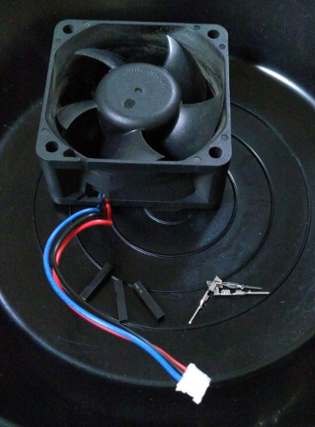
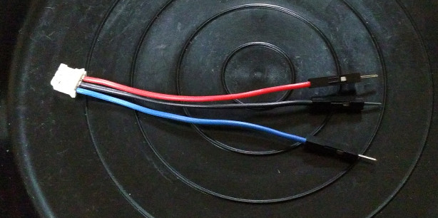
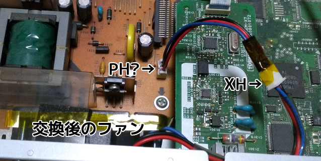

# 一周年だったのでいい加減きずいた(過去形) {#header}

2020年11月28日は、当サイトの一周年記念日でした。

なのでその日にやってたことでも書いてみようかと思います。~~その結果がこの怪文書だよ^^;~~

## きのうまでのこと(ねてないからきょうはまだどようび^^;) {#doyoubi}

ところで[^totuzen]、当初使用していたGitHub Pages + Jekyllは去年のアドベントカレンダーに間に合わせるための仮の環境であり[^yattuke]、1年以内(のなるべく早いうち)に違う環境へ移行するつもりでした。というかsafeモードなJekyllといい、Liquidといい、融通が効かないのでやってられません。

[^totuzen]: 「その日にやっていたこと」と言いつつ1年前の話をしはじめる奴ー^^;

[^yattuke]: なので開設当時も<a href="https://mstdn.maud.io/users/dekisugi/statuses/103211700178925976"><q cite="https://mstdn.maud.io/users/dekisugi/statuses/103211700178925976">やっつけた</q></a>という表現をしていた…んだっけか？

そこで今年は、気が向いた時のみながら、NanocやらCSSやらと戯れていました。ほぼ出来ていたCSSはボツにすることにしたものの、このペースで行けば次の冬までには、わたしのかんがえたさいきょうのうぇぶさいとが実現できそうです。…と思うじゃん？春先からは何にもやる気が起きませんでした。気がついたら今月の26日が終わろうとしていました。~~閏年じゃなかったら死んでた^^;~~

さあこうなったら突貫工事です。そこに使えるCSSがあるのだから、ボツであろうと使います。ちょっと触って放置していた仕掛けたちも、とりあえず使い物になるところまで持っていきます。こんな拙遅なものを出すのは不本意ですが、いつまでも(仮)が付いたままでいるよりはマシです。一通り作り上げ~~られてない~~、動作確認をした私は、ごはんをたべ、ねました、

…はい、寝ました。新居で一周年を迎えることは不可能となりました。こうなったらもう、当日のうちに展開すりゃいいんです。一周年記念事業とか称して。こうして、日が暮れるまで違うことをする余裕が生まれました(フラグ)。

## HDDレコーダーが異常な爆音を発していたのでファンを交換してたらごちうさが始まった。 {#aoburuma}

そこで、以前から異常な爆音を発していたHDDレコーダーを、意を決して修理することにしました。どうせファンのスリーブベアリングにグリスぶち込めば直ることでしょう。ところがその幻想は早々にぶち殺されます。なぜなら、軸が外れないタイプのファンだったからです。ドリルで穴開けて確認したから間違いない。

しかしちょうどいいことに、そのへんに~~ATTAのファンがあっだ~~、もといADDAのファンがあったのです。このファンはとても古いものだった気がしますが、異常な爆音を発するファンをそのまま戻すわけにもいかないため(おまけにドリルしちゃったし)、これを取り付けることにしました(フラグ)。

これを…

こうして…

こうじゃ！

完成！

コネクタの違いだけでなく、ネジ穴のサイズが合わなかったり、具合良く代用できそうなネジが手持ちに無かったりしたため、手こずりました。結局、終わったのはごちうさ放送直前でした。さあ電源を入れるぞ！

キィィィィィン！ヴオオォォォォォォォ！！！チノ「うるさいですね…」

おめでとう！いじょうなばくおんは、せいじょうなばくおんにしんかした！

## 肝心のサイト構築は、1時間もあればいけるだろという安易な考えで爆死しました。 {#keikakuseiganai}

もうね、[終わったの26時半](https://github.com/dekisugi/geeko.dev/commit/1b498643d5655a66a270bbf79afaebcbd424c788)ですよ。

一旦全消ししてからやれば手っ取り早いんですが、そこは運用中のサイトなのでコミットログを残したい。心身ともに眠い中、慣れないGitと格闘しながら、自由奔放に書いたMarkdown(Markdownではない)どもを一つ一つ確認し、修正していったらこの様ですよ。…嘘です。ますとどんみてたからです^^; 

そして追い打ちをかけるようにDNSが浸透しない。Googleが余計なこと[^dev-hsts]する手前、移転先(Netlify)でも必ずTLS証明書を用意しなければならないのですが、当然のことながらDNSが移転先に向いてないと発行されない。そしてTLS証明書が発行されないことには、DNSが向いていたところで表示できない。結局1時間くらい掛かりました。だいたい**github.ioのTTLと同じくらい**ですね。

まあこうやって終わってみればと言いますか、いやその前から気付いてはいたんだすが…なんか既製品を使ってお手軽にやりたいとか思ってたのに…どうしてこうなった！

オチが思いつかないのでここいらで終わりにします。ああ、おなかすいた…

[^dev-hsts]:
    > すべての .dev ドメインは HSTS プリロード リストに登録されているため、すべての接続で HTTPS が必要になります。
    > <footer><cite><a href="https://domains.google/intl/ja_jp/tld/dev/">.dev を使ってアピールしましょう – Google Domains</a></cite></footer>

## (追記)普通にうるさい程度のファンに再交換しました。 {#tsuiki}

正常な爆音を発するファンから、RDM6025Sに変えました。純正ファン(DELTA製)に比べたら静かとは言い難いように感じるものの、爆音ファンよりマシなのは言うまでもありません。チノちゃんも「ココアさんに比べたら静かです」と言ってました「ヴォェェェェェェェェェェェ！！！」

付属ネジは呼び寸35mmでしょうか。このままだと(当たりはしないものの)基板に到達するので、5mm弱カットしました。

