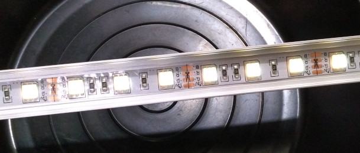
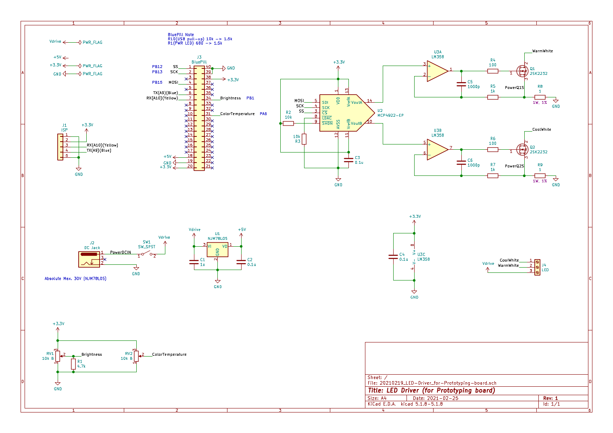
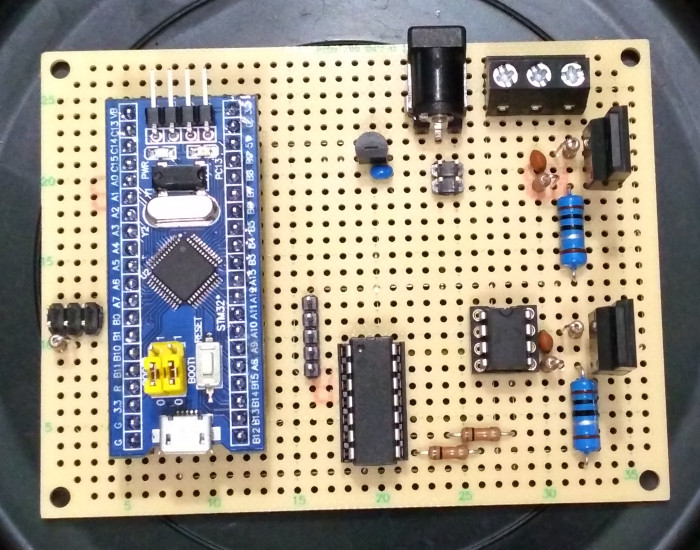
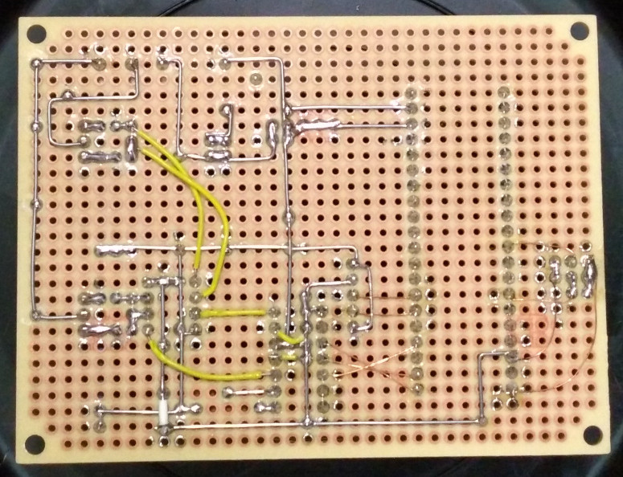

この記事は、[elchika](https://elchika.com/article/85ea9703-cf6b-4a59-984c-5e45b06b6c70/)および[筆者ウェブサイト](https://geeko.dev/one/2021/02/28/led-driver/)にて、並行公開しています。


# LED照明を作ってみた

早い話が、マイコン制御の可変定電流回路です。

- [ArduinoスケッチとKiCadファイル](https://github.com/dekisugi/led-driver)
- [デモ動画](https://www.youtube.com/watch?v=Lv3iizxAqwc)
  - 実物よりも明暗差が少なく感じます。


## はじめに

私は市販の照明に対して、何かと不満を持っています。自由を手に入れるために、LED照明の自作を試みました。

とりあえず、1つのボリュームで明るさを、もう1つのボリュームで色温度を変化させられるものを目指します。市販のLED照明のリモコンを、ボリュームに置き換えたような感じです。PWM制御も避けられる限り避けます。


## 12Vの2色LEDテープを使ってバーライトを作ります

テープLEDを、[「LED Aluminum Profile」で検索すると出てくる](https://www.google.co.jp/search?q=LED+Aluminum+Profile&hl=ja&tbm=isch)ような入れ物に仕込みました。



(写真はカバーを外して撮影しています)

この写真で確認するのは困難ですが(消した状態で撮影すれば良かった)、電球色と昼光色のLEDが1つのパッケージ入ったものが載っています。2色をいい具合に混ぜ合わせることが出来れば、お好きな白が得られます。

12V仕様で、2色LED3つと150Ωの抵抗が直列になったもので1カット分です。これを9カット分(つまり9並列)、12V電源に繋ぎ電流を測ったところ、1色あたり約172mAでした。ざっくり1カット20mA * 2色くらいですね。放熱を考えずに使われるものなので、こんなもんでしょう。

というわけで、このバーライトを制御する基板を作っていきます。


## 回路図と、部品に関する補足



全面的に手持ち部品を充てています。また、回路も理解できているとは言い難いところがあり、やや適当に決めた部品もあります。

J3にはBlue Pillというマイコンボードを挿しています。[ＤＥＫＯのアヤシいお部屋。](https://ht-deko.com/)というサイトに[素晴らしい食レポ](https://ht-deko.com/arduino/stm32f103c8t6.html)がありますので、私からは一言だけ。CS32F103C8っちゅう**パチモンMCU**にはご注意ください。スケッチが**USB経由で書き込めません**。

U1のレギュレータが無いと**Blue PillのLDOが焼けます**。この回路には24Vを掛ける予定があるのですが、それに耐える3.3Vレギュレータが手持ちに無かったので、面倒ですが2段構えになっています。こういう用途のために[LP2950L-3.3V](https://akizukidenshi.com/catalog/g/gI-08749/)なんかを持っておいたら捗りそうです。

R8、R9は電流検出抵抗です。DACの出力電圧 / この抵抗 = LEDに流れる電流 となります。今回は1Ωのものを使用していますので、DACの出力を1mV増やせば、LEDに流れる電流も1mA増えるはずです(そう上手くは行きませんが)。1/4Wのもので十分な気がしますが、温度係数の小さいものが望ましいです。

RV1はAカーブが使いたかったのですが、Aカーブの手持ちは2連のものしかないので、BカーブのものをR1で補正して、Aカーブっぽくしました。(筐体については白紙である現時点では、そもそも半固定抵抗を使っていますが…)


## 基板写真





ちょっとこの配線は頂けないです。電源ラインが錯綜して組むのが大変でしたし、写真ではごまかせてますが、黄色い線(KQE0.32)の被覆がピンセットや爪の痕でえらいことになってます。

当初、オペアンプの電源は、DCジャックの入力を降圧せずに使う予定でした。しかしそれだと、FETの定格電圧をオーバーする懸念が拭えないため、結局LED以外の電源は3.3Vに統一することにしました。最初からそうしていれば、オペアンプとDACとを縦一列で配線するという選択肢も出てきたかもしれません。そうすれば横にスペースが出来ますので、そこにDCジャックを押し込めば、上から3.3V、下からGNDという、作りやすい配線も可能だったかもしれません。


## (躓いたところ)ボリュームを絞ると、VoutBからVDD付近の電圧が出てくる

結論から言えば、シリアルモニタは積極活用すべしという、当たり前すぎる教訓が得られました。当初は一度オペアンプ以降を切り離すなど、回路的な切り分けを行っていたのですが、シリアルモニタの存在は知らなかったのです。結局原因は以下の通りなのですが、シリアルモニタを見れば一発ですよ。横着せず、ちゃんと“完全に理解”しないとダメですね、やはり。

DACの出力電圧は数百mVで十分なのですが、Vrefは3.3Vです。このままだとボリュームを少し動かしただけで大きく明るさが変わってしまい、使いにくいので、map関数で範囲を変換することにしました。ついでとして、ボリュームは最小、最大付近だとやや安定性に欠ける気がするので、この領域を使わないようにもしました。その結果、以下のようなコードになりました。

``` c
dac_value = map(analogRead(PB1) , 20, 4075, 0, 200);
```

結果的に、そのついでが仇となりました。これだとanalogReadの結果が20を下回った際、負の数が出てきたりします。この後に続くコードは、dac_valueの範囲が0〜4095を外れていると呪われてしまう仕様なのですが、まさに呪われてしまったわけです。

対策として、map関数の出力を、constrain関数で範囲内に収めるようにしました。

``` c
dac_value = map(analogRead(PB1) , 20, 4075, 0, 200);
dac_value = constrain(dac_value, 0, 200);
```

(余談ですが、[全長655kmの京王線](https://nlab.itmedia.co.jp/nl/articles/1302/14/news119.html)を思い出しました。)


## (今後の課題)オペアンプの入力オフセットが曲者だよ！

いくらか予想はしていたのですが、この回路では下限まで調光しても、そこそこ光っています。MCP4922のレジスタを0にしても、出力からは1.3mV程度出ています。これは仕様なのでしようがないですが、幸いなことにシャットダウンモードがあるので早速使いました。…なんと5mVを超えてしまいました。LM358を外し、MCP4922単独でテストすると、ちゃんと0mVまで落ちます。どうやらLM358の入力オフセットの影響のようです。MCP4922のデータシートによると、シャットダウン中は内部でプルダウンされるようですが、その抵抗は500kΩもあります。外部で1kΩでプルダウンしてみたところ、LM358の入力オフセットに打ち勝つことができました。現状の回路にはシャットダウン中の外部プルダウン機能はありませんが、改善の糸口は掴めました。というか、シャットダウン中に内部で1kΩでプルダウン出来るという、**[MCP4726](https://akizukidenshi.com/catalog/g/gI-07611/)や[MCP4725](https://akizukidenshi.com/catalog/g/gI-08459/)を買えば万事解決**な気がします。オペアンプも違うのにした方がいいですね。

ところで、動画の2秒付近でチカっとしてますが、これは電源投入直後はMCP4922がシャットダウンモードになっているからでしょう。寝室照明で無ければあまり問題になるものではないと思いますが、残念ながら私が一番欲しいのは寝室照明だったりします。

電流制限抵抗も増やした方がいいかもしれません。この値を10倍にすれば、オペアンプのオフセットの影響も10分の1になるはずなので。デメリットが無いわけではないですが、負荷が1Aを切っているようなうちは、メリットが上回る気がします。


## おわりに

そんなこんなで、とりあえず2月中に形にすることが出来ましたが、オペアンプのオフセットやら、最低輝度の件やら、何かと課題も多いです。そういえば保護回路もありませんね。ソフトウェアもまだまだ未熟です。

それでも、実際に動くものが手に入ったことは大きいです。自由に扱える基板さえあれば、ソフトウェア的なアイデアはいくらでも試すことができます。良さそうなLEDを見つけたら、実際に調光して試食ができます。後は、私のエネルギーの問題かなぁ…^^;


## 特に助かった記事

Webの記事という記事に助けられてここまで来ましたが、特に助かった記事に絞って紹介します。

[第3回：電流信号を作り出す回路（前編） \| アナログ・デバイセズ](https://www.analog.com/jp/education/landing-pages/003/Choitashi2014/choitashi-manga/choitashi_vol3.html)

漫画はさっくりですが、PDFの方では、オペアンプを使った定電流回路について詳細に解説されています。この記事で参考にすべきなのは、動作原理です。今回の回路の場合、記事が言うほどの精度は不要でしょうし、基本を押さえた上で気楽に行きましょう。

[最短でKiCadを使えるようになりたい - manvaのエンジニアリング魂](https://manva.hatenablog.com/entry/2020/09/22/201819)

とてもありがたかったです。この記事が無ければ、今頃方眼紙にレイアウトを描いていたことでしょう。

