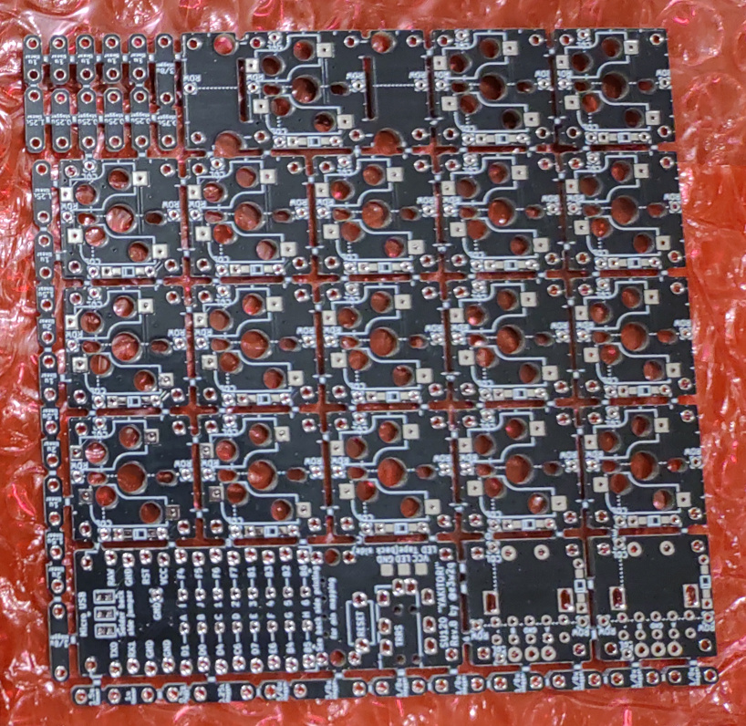
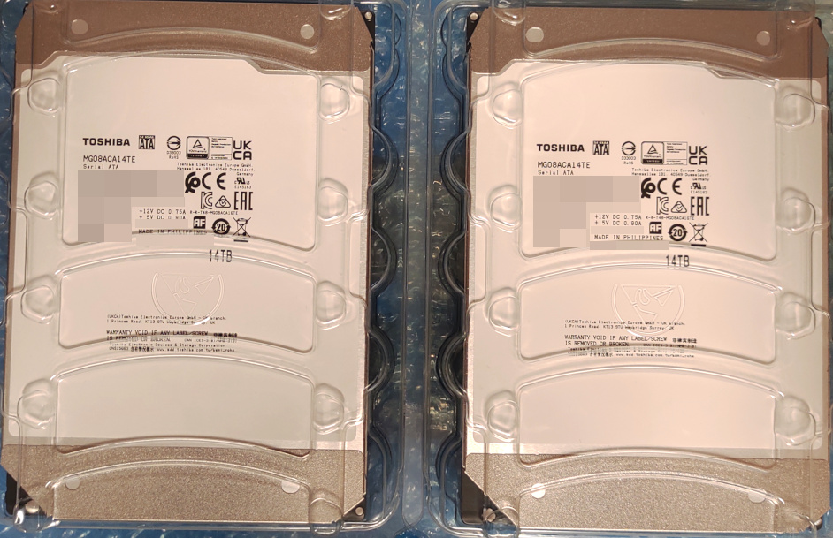

= 2021年を振り返ります(ただし12月は少ない)。

これはlink:https://adventar.org/calendars/6291[大アドベントカレンダー令和三年末代場所]の五日目の取組です。昨日はじらびさんの「link:http://giraffeheavyfactory.blog.jp/archives/31348002.html[自転車にエンジンを載せて変速機を追加する]」でした。

どうも皆様、出__来__杉君と申します。末代アドカレは2年ぶりの参加です。コツコツ作り上げられた物を紹介された直後に、こんな当日に書いている急場しのぎの記事をぶつけるのは怖いですが、仕方ありません。なぜなら前回に引き続き、締め切りに間に合わなかったからです。

[link=./SU120-PCB.jpg]

これとか…

[link=./MG08ACA14TE.jpg]

これとか。

何かしらはあったんですが、手を付ける余裕がありませんでした。なので今年の振り返りをやります。

[[game]]
== やったゲームとか。

[[osui-mayor]]
=== Cities: Skylines: 汚水力発電最高！

1月は久しぶりにCities: Skylinesをやり、link:https://mstdn.maud.io/@dekisugi/105594862360209994[汚水力発電所]を作ってました。ふざけてるようで、まあ実際ふざけて作ったんですが、こいつ、都市の電力を半分くらい賄ってくれるスゴイ奴なんですよ。

しかしここで、link:https://mstdn.maud.io/@dekisugi/105594871741996258[下水を排出する施設を増設しようとして、間違えて取水ポンプを設置する]というミスをしでかし、大量の死人と人口流出が発生。期せずして私もlink:https://www.youtube.com/watch?v=kAa_CuPX5s4&list=PL-O4RqFKLrZQtAwzG9Ju2dlUAto8UHvz0[汚水市長]の仲間入りを果たしたのでした。(この後めちゃくちゃ火葬場建てた。)

[[shapez-io]]
=== shapez.io

これはFediverseで見つけたものだった気がします。

図形を切ってくっつけて色つけて重ねて、複雑な図形を作る工場を作ります。レベルが上がると自動ラインを組めるようになります。こんな説明は公式で見やがれ。link:#led-driver[LED照明]の方に飽きる直前のことは書いてあります。

[[ehonpainc]]
=== えほんパニック！

2月にlink:https://www.freem.ne.jp/win/game/21092[えほんパニック！]というゲームをやりました。

絵本とか昔話とかに出てくるような話を題材にしたゲームですが？、キャラが立ってておもしろいんですよー。

[[maounanoda]]
=== 魔王による魔王のための魔王退治

3月にlink:https://www.freem.ne.jp/win/game/25121[魔王による魔王のための魔王退治]というゲームをやりました。

魔王がねーかわいいんだよー。あと変なアイテムがいっぱいあっておもろい。

[[rimworld]]
=== RimWorldを1年ぶりにやった

9月10月あたりはRimWorldをやってました。

去年のデータは使わず、某攻略サイトの効率的なコロニー設計図を参考という名のもとでパクり、1から始めました。初日だけはまずまずだったのですが、その後がグタグダでした。全然進まない。私がキャラバン好きすぎたのがアカンかった。あと食人一族であることを優先したので、そもそも能力が高い人を選びにくかったというのもある。

[[led-driver]]
== 照明向けLEDドライバを作って秋月のクーポンをもらった

link:#shapez-io[前述のshapez.io]はそこそこ面白かったんですが、効率が悪いとはいえ自動ラインを作ってしまったところで飽きが来ました。自動化をするには論理回路組まなければならないのですが、ゲームでそれをやるくらいなら、実際の回路を組んだほうが良いと思い、以前より興味があったLED照明を作ってみることにしました。2月のことです。

製作にあたり参考情報をググっていたところ、link:https://elchika.com/[elchika]という、Qiitaの電子工作版的なサイトを発見しました。そこでちょうど、link:https://elchika.com/promotion/akihabara2021/[ハードウェア作品投稿キャンペーン]という、作ったものとその作り方を載せるだけで数千円分の電子工作関連商品かクーポンがもらえるという、太っ腹すぎて怪しさ満点なキャンペーンが開催されていることを知りました。

どうにか期限である2月中に間に合わせるべく、SNSを絶ちfootnote:[notestockによると2月は7件しかトゥートしてなかったらしく、link:https://notestock.osa-p.net/%40dekisugi%40mstdn.maud.io/20210210/view[カレンダーもスカスカ]です。]、link:https://elchika.com/article/85ea9703-cf6b-4a59-984c-5e45b06b6c70/[期限ギリギリに上げたのがこちらの記事]です(link:../../../../2021/02/28/led-driver/[当サイトでもミラーしています])。タイトルでは盛ってますが、LED部分はテープLEDに電線付けて、入れ物に貼っつけただけなので、実質的にはLEDドライバを作った感じですね。

とりあえず形になった程度の完成度でしかないのですが、特に最終日付近の追い込みがしんどく、心身ともに燃え尽きてしまい、結局あれ以来放置しています。改良のための部品は、頂いたクーポンを使ってある程度買ってきてあるので、来年こそは本気出せたらなと思います。(今年の残る26日を無いように言ってる時点でお察し。)

[[puridamu]]
== 気付いたらぷりだむのオタクになっていた

4月くらいからlink:https://www.youtube.com/channel/UCIavZA-8-vVajzEF8SVMzog[ぷりだむ]というグループを推しています。

ちゃんと紹介したいんですけど眠すぎて一周回って眠くなくなってきたのでメンバーのことを雑に紹介していこうとおもいます。

[[amane]]
=== あまねくん

紫色担当、死の国の王子、link:https://www.youtube.com/channel/UCqOI_84fGdmDpp0fTWxlRAw[あまねくん]です。さん付けで呼ばれることも多いです。

最近作のlink:https://www.youtube.com/watch?v=n1cJSOVAh_g[Shadow Shadow]を紹介します。ああああああ耳があまねくんに心略されるぅぅぅぅぅぅ！！いやぁもう流石は垢BANとおすすめ規制の常連なだけありますね。息遣いがえろすぎぃぃぃぃぃ！！！3150ー！！

[[soara]]
=== そあらくん

水色担当、氷の国の王子、link:https://www.youtube.com/channel/UCjvocy4t5TaktsRDbMuHzqA[そあらくん]です。そくんと呼ばれることも多いです。

公開されたばかりのlink:https://www.youtube.com/watch?v=2hmcnRdec0E[恋模様]を紹介しようと思います。この曲は元々link:https://store.universal-music.co.jp/product/uicz4585/[8月に発売されたアルバム]に収録されている曲なのですが、5日の夜にMV付きでYouTubeに投稿されました。いやー、MVとの相乗効果で箔が付きましたねfootnote:[動画の歌詞間違えてるけど！]。アドカレ落としたおかげで紹介できました遅刻魔の私GJ。

[[pochiinu]]
=== ぽちいぬくん

黄色の王子、犬の国担当、link:https://www.youtube.com/channel/UCC3IOkTEVz-Izqa2sieiyFA[ぽちいぬくん]です。ぽちくんなどと呼ばれることも多いです。

ぽちくんはlink:https://www.youtube.com/watch?v=27_ivLxiZEE[おじゃま虫Ⅱ]を紹介しておきます。本当はこれを書きながらも聴きたいんですが、かわいすぎて聴いたら力抜けちゃうので聴くに聴けない。

これを聴いたらかわいい人だと思うでしょうし、実際に初見さんもかわいいとコメントすることが多いんですが、ぽちくんの魅力はこんなにかわいいのに、かっこよくもあることなんですよ。なんでしょうね、いつもより低めの声を聴いたんだったか、ぽちくんに惚れる瞬間があったんですよね。それ以来ぽちくんの声のかっこいい成分に気付くようになったような気がします。

ぽちくんは5人で歌う時は低めのパートを担当することが多いのですが、最近はぽちくんのパートになると、オタク特有の気持ち悪い吐息が出てきてしまいます。私は箱推しで、そして5人それぞれのリスナーという気持ちでは居るのですが、こうなるとぽちくんが最推しと言わざるを得ない。だって体が反応しちゃうんですもん。

[[a-lun]]
=== あーるん。くん

赤色担当、忍びの国の王子、link:https://www.youtube.com/channel/UCTXq6Pnwj77ji0Gur2YqJVQ[あーるんくん]です。るんくんと呼ばれることも多いです。「。」までが名前ですが、くん付けする場合や、文中においては、別に句点は付けなくて良いそうです。footnote:[2021年9月23日(木)の朝枠より。]

事あるごとに歌が苦手と主張しておられますが、5人で歌うに際しては要となっている気がします。要が過ぎてパート分けで下に飛ばされたり上に飛ばされたりと忙しい人です。

というか私はそもそもるんくんの歌に一目惚れしたんですよ。あんま細かいこと書くと界隈の方で語る余地が無くなりかねないので軽く済ませますが、私はこれがきっかけでぷりだむを知ったので、もうちょっと自信持って欲しいなとは思いますあと寝てください(ブーメラン)。

そんなこんなで歌を紹介しようかとも思いましたが、ここはあえてlink:https://www.youtube.com/watch?v=yJYeYO05UxU[弟のちびるんとのゲーム実況(一人二役)]を紹介しようと思います。これ、リアルタイムで見たほうが感動するかもしれませんが。もう本当に二人居るようにしか感じない。こういうことをやり続けた結果、それが歌にも生きてきてるんですよね。だから歌もだけれど、こういう兄弟の会話っぽいものも紹介したいなと。

[[napi]]
=== なぴくん

桜色担当、お人形の国の王子、link:https://www.youtube.com/channel/UCt1q3ONDWaP-FzXnWKLmPew[なぴくん]です。くんまでが名前です。私の名前みたいな感じですね。

なぴくんについては、ある方がドハマりしていたlink:https://www.youtube.com/watch?v=AiJBp10a_qQ[Magical Word]を紹介しておきます。どちゃぼこにかわいいので、15秒だけでも聴いてみてください。

ところで、先日るんくんが「ひらがな表記の時はくん付けるのに、ローマ字表記の時はkun付けないのよ」と、なぴくんの名前の表記をめんどくさがっていたfootnote:[2021年12月2日(木)の夜枠より。]のですが、実は私もそのめんどくさい表記だったりします。日本語で書くと“出来杉君”ですが、英語で書くと“Dekisugi”なんです。思わぬところになぴくんとの共通点を発見しました。

[[thinkpad-x260]]
== 中古のThinkPad X260を買った

今までメモリ2GBのCherryTrailタブレットを使っていたのですが、今日日こんな性能ではWindowsはまともに動きません。単語1つ入力するのに5秒10秒掛かり地獄です。そんな折、楽天のキャンペーン(主にモバイル)で大量の期間限定ポイントが入ってきたので、6月にlink:https://mstdn.maud.io/@dekisugi/106396930715764076[中古のThinkPad X260]を買いました。

この機種のディスプレイはいくつか選べ、大きく分けるとフルHD(1920×1080)とFWXGA(1366×768)とがあります。私は前者が欲しかったのですが、ちょっとお高い。メモリも少なくとも8GBは欲しいですし、SSDに換装する予算も必要でしょう。

そんな中、ディスプレイはフルHD、メモリは8GBでおまけにSSDも搭載し、かつ価格も3万切りという出物を見つけました。カメラが使えないので安くなっているそうですが、別に使わないので、これを買いました。実際にはカメラと同じ基板に付いているマイクも使えなかったのですが、まあ安かったので大目に見るとしましょう。

トラックポイント、良いですね。慣れるのに時間が掛かるかと思いましたが、1日でまあまあ慣れました。場所は取らないし、手もあんまり動かさないで良いので使いやすい。タッチパッドと違って摩擦で指が痛くなることもないですし。

一方キーボードはちょっと気になりました。普段使っているキーボードと比べて、正直固い。まあ使っていればある程度は慣れるのですが、特に最初は打ち損じが多かったです。それでも、アップデートの度にまともに反応しなくなっていく、地獄のCherryTrailタブレットのタッチキーボードに比べたら、十分天国と言えます。

動作は比較的快適です。主にブラウザとテキストエディタしか使いませんし。仮にまたアップデートで重くなっても、CPUは無理ですがメモリなら交換できますし、何より3万切りなので数年使えればそれで良いです。

ところでこれはノートPCの宿命ですが、寝転がって使うということに難があります。その点においてはタブレットが恋しい。おかげでスマホの使用時間が爆上がりですが、やはりPCと同じOSが動くタブレットに比べると、いまいち柔軟性が低く感じます。漫画やイラスト(そぎぎとは限らない)を見るにしても、画面サイズの大きいタブレットの方が有利でしたし。手頃な価格で数年くらい戦えるWindowsタブレット、どっかに落ちてないかなぁ…

[[sakujo-irai]]
== 自称弁護士から知らない掲示板への削除依頼が来た

8月7日、link:https://mstdn.maud.io/@dekisugi/106713933976272586[弁護士を名乗る者から掲示板の書き込みを削除してほしいとのメールが届きました]。この件はlink:../../../../2021/08/08/sakujo-irai/[記事にまとめて]あります。

当時はなんとなく書かないでおいたんですが、発見できた連絡先に対して、駄目元で、手当り次第送ったんじゃないかと、そんなことも疑いましたね。一応当人は「勘違い」と言ってましたが。

まあ何にしても、ネット絡みで何かトラブルがあったとしたら、この人には依頼したくないと思わせる出来事でした。ネットの文化に疎そうに感じたので。

[[kin-niku-senshi-comirnaty]]
== SARS-CoV-2の予防接種を受けた

10月6日と27日に、link:https://mstdn.maud.io/@dekisugi/107052414359316183[コミナティ筋注をぶち込まれて来ました]。

1回目の接種の後、あちこち歩き回ったのがマズかったんですかね。なんか疲れと副反応が重なったのか、2日目は全身の筋肉が痛いし、摂取した方の腕はほとんど動かないし、まあまあ不便しました。ご飯とかは普通に食ってましたが。

2回目の接種の後も、まあまあ歩き回っちゃったので覚悟してたんですが、こっちは意外と普通に過ごせたんですよね。まあこういう、2回目の方が楽だったって人も居るってことで。

とりあえずこれで接種証明は手に入ったので、link:https://twitter.com/prdm_official/status/1459125250721923077[来年3月末]も安心ですね。時期的に、肝心の抗体価はだだ下がりでしょうが。

[[owata]]
== おわりー！

もう頭がlink:https://open.spotify.com/track/0T48PF4mfiK6S30XeMNCa8[ふわふわのわたあめ]になってまともに書けませーんw箇所によって全然テンションとか分量とかが違うってのはそういうことですwwwいえーい！

末代アドカレ、六日目はlink:https://hachiroute.urishari.com/2021/12/07/unity%E3%81%AEterrain%E3%81%A7%E6%A5%BD%E3%81%97%E3%81%A6%E5%A4%A9%E5%9C%B0%E5%89%B5%E9%80%A0%E3%81%99%E3%82%8B/[8号さん]です。なんか私が上げるのを待ってくれてる気しかしない。

