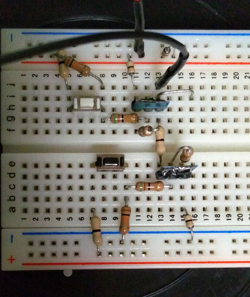

~~この具は闇鍋の9個目の具です。~~ …開始早々間違えまみた^^;

この記事は[mstdn.maud.io Advent Calendar 2019](https://adventar.org/calendars/3963)の9日目の記事です。**…誰がなんと言おうとも9日目の記事です^^;**  
**昨日は**はちみつさんの[同人サークルとしての「秘密結社あかねぶるー」の今後について](https://8mitsu.net/540)でした。

どうも皆様、[出来杉](https://mstdn.maud.io/@dekisugi)でございます。  
**本日は12月9日月曜日**ですね。26時を回り、夜も更けてまいりました。

無線制御(嘘はついてない)は~~気乗りしなかった~~そこまで必要性を感じなかったので保留に、リアル栄養ペーストは絶賛放置中でございます^^;

…ネタどうすんのよ^^;  
…よし！あれじゃ！ToDo消化企画じゃ！
というわけで本日のお話は…

# 夕イム口ー夕ーを作った(嘘)
…結論から言うと、**間に合いませんでした**^^;  
何せ組み始めた時点で、残り時間がこれだけでしたから^^;


というわけで今回の記事は、単なる日記となってしまいました。  
本当はもうちょっと技術的なことをやりたかったのですが…しかたないね(つくもたん)

## そぎぎじゃねーか！？
おっしゃるとおり、~~パク…~~ネタ元はアダルトグッズです。  
しかし、今回の工作？は純粋に己の欲求を満たすために行っているもので、ゲフンゲフンな要素は排除しています。…今言った欲求とは、知的な欲求のことです。言葉足らずでした。  
よって、この記事にはアダルトな要素は含めていないつもりですが、「この記事を参考に工作をしたら大人のおもちゃが出来上がった！訴訟！」などと言われても責任は取れません。そぎぎはみんなのこころのなかにあります。私を~~パコ…~~パカらないで^^;

## モータードライバが無い！
というわけでそこから作る必要があります。細やかなヴァイブレイションを実現させるために、ブレーキ機能も必要です。  
とっても計画的な私は、回路を事前に考えておいたので、その点は問題ありませんでした。~~その点はね…~~

しかしブレーキが効きません。よく見ると抵抗を刺す穴が1箇所ずれていました。まあこの手のエラーの原因なんて結構つまらないものです。

というわけでモータードライバが完成しました。この時点でタイムリミットまで1時間半程度でした。



## モータードライバに二時間！？
なぜ前段で2時間近くを要したか。モータードライバに手間取っていたわけではありませんでした。

8ヶ月ぶりに[Blue Pill](https://ht-deko.com/arduino/stm32f103c8t6.html#01_01)を触るにあたり、改めて情報収集をしていました。電源はモーター用の5VからBlue Pillに供給するつもりだったので、レギュレーター周りの回路図を確認しておきたかったのです。だがしかし、~~その少女は少しおかしかった…~~STM32duino wikiが無くなっていました。これは困った…

ググって他の情報源をあたったのですが、目ぼしいものは見当たらず。  
結局[Wayback Machine](https://web.archive.org/web/20190316163044/https://wiki.stm32duino.com/index.php?title=Blue_Pill)に頼りました。というか最初からそうするべきでした。

## 閑話休題(とか言ったそばから無駄話する奴ー)
ぶっちゃけモータードライバも本筋とは言えないので、二重の意味でようやく本題に取り掛かれることになります。

しかし時間がありません。  
「モータードライバを作った」という記事にしてやっつけようかと思いましたが、まあそんなん見ても仕方ないですよね。というかそんなん読むなら
[こ](https://micro.rohm.com/jp/techweb_motor/knowledge/)
[の](http://miqn.net/periph/63.html)
[へ](http://srd.s43.xrea.com/circuit_learning/motordrive.shtml)
[ん](http://yuqlid.hatenablog.com/archive/category/%E3%83%A2%E3%83%BC%E3%82%BF)
でも読んでた方が為になります。なった。

…いやもう時間ないでしょ無理でしょ^^;  
と言っても行けるところまで行きたいわねというテンションなので、とりあえず進めることにします。

## 制御部を作ろう
というわけで適当にPWM出力するコードを書いて、モータードライバが動くことだけでも確認します。

```c
int motorPin = PB0; // Active-H PWM
int breakPin = PB1; // Active-L digital
int ledPin = PC13;  // Active-L digital

void setup() {
  // put your setup code here, to run once:
  pinMode(motorPin, OUTPUT);
  digitalWrite(motorPin, LOW);
  
  pinMode(breakPin, OUTPUT);
  digitalWrite(breakPin, LOW);
  
  pinMode(ledPin, OUTPUT);
  digitalWrite(ledPin, LOW);
}

void loop() {
  // put your main code here, to run repeatedly:
  delay(10);
  digitalWrite(breakPin, HIGH);
  for(int duty=0; duty<=255; duty++){
    delay(10);
    analogWrite(motorPin, duty);
  }
  delay(10);
  analogWrite(motorPin, 0);
  delay(10);
  digitalWrite(breakPin, LOW);
  delay(1000);
}
```

まずはモータードライバの代わりにLEDをつなぎ、制御部単体での動作を確認します。  
オシロスコープ(DSO 150(のようなもの))でもきちんと波形が確認できました。

制御部が正常に動作していることを確認できたところで、モータードライバをつなぎます。  
さすがに0%から直線的に電力を増やしていってるので[^1]、最初は回らずに苦しそうな音を出していますが、無事動作を確認できました。

しかし、ブレーキ用のMOSFET(AO3401(自称))がアッチッチです。これは燃えるかもしれません。  
そう思いつつ、写真や動画を撮影していたところ、奴から煙が上がってました。慌ててスイッチを切ったので大事には至りませんでした。

そうこうしているうちに、タイムリミットまで20分を切りました。  
オチもついたことですし、今日のところはこれで切り上げることにしました。

はい完成！~~してない^^;~~


## おわりに
~~日付が変わった…~~夜が更けてしまったものの、何とか期限内に完成させることができましたできませんでした二重の意味で^^;

いっその事、実況トゥート形式にでもしていれば、記事部分については~~日付をまたがなかった~~24時を回らなかったかもしれません。  
しかしそれではタイムラインに気を取られていたことでしょう。~~萌える~~モータードライバさえ完成させられなかったかもしれません。そして何より、この~~闇鍋~~お祭りに参加している感？を得るためにも、こういった形式で公開するべきだと思っていました。まあ薄い本とかじゃありませんし、遅れたところで誰に迷惑かかるわけでもないですし、己の心に従わせてもらいました。~~というわけで私が前例作っておいたからお前ら軽い気持ちで落とすといいぞ^^;~~

**明日**~~(大嘘)~~はたさなんさんの記事です。


[^1]: 要するに、最初のうちはPC用のファンを1V以下の電圧で回そうとしている状態になっています。回らないばかりかファン(モーター)や回路を痛めかねないので、5V未満で回そうとした場合は無視するなどの対策をコードに組み込むべきです。
